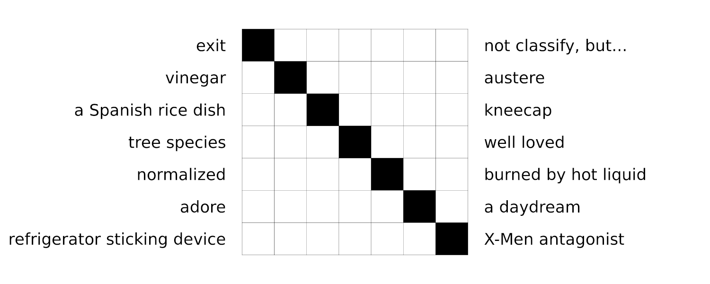

## Overview

This Shiny dash helps generate a word puzzle by running through a dictionary to find matching pairs of words that fit the structure of the puzzle. [Click here to try it out!](https://dlependorf.shinyapps.io/diagonal_word_puzzle_generator/)

## The Puzzle

If this style of word puzzle has an established name, I'd love to hear it.

This puzzle presents a grid of squares with a strip of shaded squares running down the diagonal. To fill in each row, find a word that matches the clue on the left side that fits in the unshaded squares only. Adding a letter in the shaded square should transform the word so that it matches the clue on the right side. When all of the words are placed, the diagonal letters top to bottom will spell out the final answer. The solution to the above puzzle can be found [here](example_puzzle_solution.png).

## Instructions

To begin, input the diagonal word you want the shaded squares to spell, and click Submit Diagonal Word. For each letter in the diagonal answer, the dash will run through a dictionary and find words in the dictionary of the same length that also make valid dictionary words when a letter in the correct spot is removed. The results will be displayed in dropdown boxes, one for each puzzle row.

For longer words, this may not be successful for all letter positions! If more matches are desired, flip the Use Extended Dictionary toggle. This switches to a much larger dictionary, which may find better matches, but will also turn up a bunch of incredibly obscure words, which is why it's turned off by default.

Select a word pair in each dropdown and fill in the clues on the right. To download the generated puzzle, flip the Show Answers toggle and click the Download Puzzle button in the bottom left. If you want a copy of the puzzle with the answers, you can flip the Show Answers toggle back on and download the image again.
